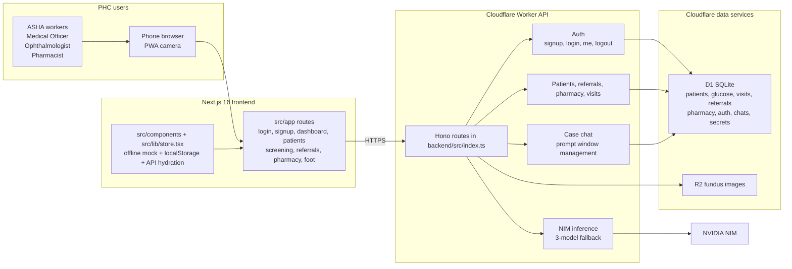

<!-- markdownlint-disable MD033 MD038 MD060 -->

# GlucoVision — Offline-first explainable diabetic retinopathy screening for rural PHCs

<p align="center">
  <strong>Next.js 16 frontend + Cloudflare Workers API + D1/R2 + NVIDIA NIM fallback</strong><br />
  Screen, explain, refer, and follow up from one shared clinical workflow.
</p>

<p align="center">
  
  <br />
  <strong>Prevent blindness before it starts.</strong><br />
  Offline-first • Explainable • eSanjeevani-ready • PHC Edition
</p>

<p align="center">
  <a href="https://github.com/manish-9245/GlucoVision/actions"></a>
  <a href="https://github.com/manish-9245/GlucoVision/blob/main/LICENSE"></a>
  <a href="https://github.com/manish-9245/GlucoVision/stargazers"></a>
  
  
  
  
</p>

<p align="center">
  <a href="https://glucovision.pages.dev"><strong>🌐 Live Demo — glucovision.pages.dev</strong></a> •
  <a href="https://glucovision-api.wethreemusks.workers.dev/api/health">API Health</a> •
  <a href="#-quickstart">Quickstart</a> •
  <a href="#-architecture">Architecture</a>
</p>

> **Smart India Hackathon 2026 — PHC Edition.** A clinical screening suite for diabetic retinopathy that works with an **ophthalmoscope + phone**, keeps PHCs **offline-first**, and makes every result **explainable** with Grad-CAM so ASHA workers, Medical Officers, and ophthalmologists can verify what the model saw.

**Keywords for SEO:** `diabetic retinopathy`, `AI screening`, `fundus photography`, `rural health`, `PHC`, `ASHA`, `offline-first`, `explainable AI`, `Grad-CAM`, `eSanjeevani`, `telepharmacy`, `Next.js`, `Cloudflare D1`, `NVIDIA NIM`, `Smart India Hackathon`

---

## ✨ Why GlucoVision

| Rural India has | GlucoVision gives |
|---|---|
| 100M+ diabetics, 70% rural never screened | **One phone + ophthalmoscope** — clip-on optional, no fundus camera procurement |
| No internet in villages | **Offline-first** — on-device CNN `<2.1s`, encrypted local storage, SMS queued, syncs later |
| No ophthalmologist at PHC | **Explainable AI** — 5-stage CNN (APTOS/IDRiD) + **Grad-CAM heatmap** + confidence + plain language → **eSanjeevani** referral in one tap |
| Lost to follow-up | **Continuity** — glucose trends + eye + foot + telepharmacy in one record, PHC dashboard with coverage & camp planning |

---

## 🎥 Demo

- **Landing:** Cinematic hero, gapless bento, GSAP pinned scroll, horizontal accordions, testimonial carousel — `http://localhost:3000/`
- **App:** `Login → Dashboard → Patients → Screening (live camera + blur gate + NIM) → Referrals → Telepharmacy → Foot`
- **Demo logins** (`demo123`): `asha@glucovision.in` (ASHA), `mo@glucovision.in` (MO), `eye@glucovision.in` (ophthalmologist), `pharma@glucovision.in`, `admin@glucovision.in` — works offline without backend

---

## 🏗️ Architecture — UI ↔ API with offline fallback



**Frontend** (`src/`) — Next.js 16 App Router, offline mock/store fallback, live camera screening with blur gating, explainable AI review, patient management, referrals, telepharmacy, foot screening, and case chat. The current route set is `login`, `signup`, `dashboard`, `patients`, `screening`, `referrals`, `pharmacy`, and `foot`.

**Backend** (`backend/`) — Hono Worker with auth, patient records, referral and pharmacy workflows, case chat, encrypted secrets, D1 persistence, optional R2 image storage, and NVIDIA NIM inference with fallback across multiple models.

**Cloudflare DB — D1 (SQLite):** `backend/migrations/0001_initial.sql` through `0007_foot.sql`, plus `backend/migrations/0004_auth.sql` for users and PBKDF2 demo hashes. `backend/seed.sql` carries the current demo dataset for patients, referrals, and pharmacy records.

---

## 🚀 Quickstart

### 1) Frontend (offline mock — no backend needed)

```bash
git clone https://github.com/manish-9245/GlucoVision.git
cd GlucoVision
npm install
npm run dev
# http://localhost:3000
# Login: asha@glucovision.in / demo123
```

### 2) Full stack with Cloudflare D1 + R2 + NIM (local)

```bash
cd backend
npm install

# D1 + R2
npx wrangler d1 create glucovision
# copy database_id into backend/wrangler.jsonc d1_databases[0].database_id
npx wrangler r2 bucket create glucovision-images # or skip — upload falls back to data URL

# Secrets (never commit plain .env)
echo "RANDOM_32B_BASE64" | npx wrangler secret put ENCRYPTION_KEY
echo "RANDOM_32B_BASE64" | npx wrangler secret put JWT_SECRET
echo "nvapi-..." | npx wrangler secret put NVIDIA_API_KEY

# Migrate + seed
npx wrangler d1 migrations apply glucovision --local
npx wrangler d1 execute glucovision --local --file=./seed.sql
# (fix seed.sql: remove PRAGMA/BEGIN if `SQL BEGIN TRANSACTION` error — already fixed)

npx wrangler dev --persist-to=./.wrangler/state --port 8788
# Worker http://localhost:8788 — test: curl http://localhost:8788/api/health

# In repo root .env.local:
# NEXT_PUBLIC_API_URL=http://localhost:8788
cd ..
npm run dev
```

### 3) Deploy

```bash
# Backend
cd backend
npx wrangler d1 migrations apply glucovision --remote
npx wrangler d1 execute glucovision --remote --file=./seed.sql
npx wrangler deploy
# → https://glucovision-api.<subdomain>.workers.dev

# Frontend — Cloudflare Pages (OpenNext) or Vercel
cd ..
npm run build
npx opennextjs-cloudflare build
npx opennextjs-cloudflare deploy
# or: wrangler pages deploy .open-next/assets --project-name glucovision
# Set env in Pages: NEXT_PUBLIC_API_URL=https://glucovision-api.<subdomain>.workers.dev
```

---

## 🔬 AI — NVIDIA NIM, 3-model fallback, keeps `import requests`

**Worker** `backend/src/nim.ts:18` mirrors **Python backup** `backend/nim_backup.py:55` — exact payloads you provided:

1. `nvidia/nemotron-3-nano-omni-30b-a3b-reasoning` `stream False` `reasoning_budget 16384`
2. `moonshotai/kimi-k3` `stream True` `reasoning_effort max`
3. `meta/llama-3.2-90b-vision-instruct` `stream False`

```python
# backend/nim_backup.py — keep import requests
import requests
invoke_url = "https://integrate.api.nvidia.com/v1/chat/completions"
headers = {"Authorization": "Bearer $NVIDIA_API_KEY", "Accept": "application/json"}
payload = {"messages": [{"role":"user","content":[{"type":"text","text":prompt},{"type":"image_url","image_url":{"url":image_url}}]}], "model": "nvidia/nemotron-3-nano-omni-30b-a3b-reasoning", ...}
response = requests.post(invoke_url, headers=headers, json=payload, stream=False)
```

Worker `callOne()` `src/nim.ts:67` does `fetch(INVOKE_URL)` with `85s` abort, collects `text/event-stream` like `for line in response.iter_lines(): print(line.decode("utf-8"))` vs `response.json()`. `POST /api/nim/infer` loops `for (m of MODELS)` — **if one fails other must work**, audit to `nim_requests` D1, `POST /api/nim/infer-stream` proxies stream.

**Frontend** `src/app/app/screening/page.tsx:306` `runInference` — converts `preview blob:` → `FileReader dataURL` → `fetch ${API}/api/nim/infer {image_url, prompt, patientId}` → parses `stage/confidence` else falls back to `simulateInference(patient.riskScore)`.

**Encrypted creds** `backend/src/crypto.ts:1` AES-GCM 256 Web Crypto, `storeEncryptedSecret` / `getEncryptedSecret` D1 `secrets` table (`backend/migrations/0002_secrets.sql`), Python `encrypt_and_save_all_creds()` `src/nim_backup.py:32` Fernet → `.env.encrypted` (base64 fallback). Never commit plain `.env` (see `.gitignore`).

---

## 📸 Camera + Blur — instant flag, smooth, functional everywhere

`src/lib/blur.ts:4` `estimateBlurScore` — downscale to `160px`, grayscale luminance, Laplacian `[0,1,0;1,-4,1;0,1,0]`, variance → `quality 0-100` (`<18 very-blurry 22-48`, `<55 blurry 48-68`, `<130 ok 68-86`, else sharp). `src/app/app/screening/page.tsx:272` live loop `requestAnimationFrame` `120ms` (was 320ms) → `setLiveBlur` + `setQuality` instantly, `border-[3px] border-red-500 shadow-red` when `isBlurry` vs `border-emerald-500` when `≥80`, banner `Too blurry • 42/100 var 12.3 / Hold steady`. Capture `disabled` if `liveBlur?.isBlurry`, `quality<60` blocks inference. Same on foot `src/app/app/foot/page.tsx:128`. Upload `computeQualityFromFile` uses real blur, not random.

---

## 💬 Discuss case — state-of-art prompt + context management

`src/components/CaseChat.tsx:1` ↔ `backend/src/chat.ts:7` `SYSTEM_PROMPT` (8 rules: explainable lesions + heatmap, stage 0-4 strict, confidence + protocol, no auto-prescription, red flags, Hindi switch, JSON `{summary,findings,stage,confidence,lesions,gradcam_note,next_step,referral,disclaimer,follow_up}` + markdown, blur gate). **Few-shot** 2 examples (Moderate exudates, No DR). **Context** `patientContextBlock()` injects `28` real patients: `age/gender/village, diabetesYears/type, HbA1c, BP, risk, symptoms, meds, glucose trend last4, prior visits, lastScreened, foot` + `visit.image_url`. **Window** `MAX_HISTORY_TURNS=8`, `MAX_PROMPT_CHARS=9000`, sliding window drops oldest pair if over budget. UI shows `preview` thumbnail + `Include image` toggle, history `max-h-[320px]`, `POST /api/cases/:patientId/chat` persists `case_chats` D1.

---

## 🔐 Auth — end-to-end coherent

`backend/migrations/0004_auth.sql:1` `users(id,name,email,password_hash,salt,role phc village)` PBKDF2 `100k` `src/auth.ts:12`, `JWT HS256` `src/auth.ts:28`, `POST /api/auth/signup|login`, `GET /api/auth/me`, `POST /api/auth/logout`, `GET /api/auth/users`. Seeded 5 demo `demo123` with precomputed salts/hashes. Frontend `src/lib/auth.tsx:1` `AuthProvider` — `localStorage gv_token/gv_user`, `USE_API` → `fetch /api/auth/me` else offline mock (role inferred from email prefix), `src/components/AppShell.tsx:22` guards `if (!loading && !user) router.replace("/login")`, shows `Logo` + user `phc/village` + `LogOut`. Flow ` / → /login` → `/app/dashboard` → `Patients` → `Screening (camera+blur+NIM)` → `Referrals` → `Pharmacy` → `Foot`.

---

## 🖼️ Images — all related, local `public/images`

No `picsum`. All `public/images` local, Google Search via `Category:Rural health in India` Wikimedia Commons (Bharat Nirman eye/blood camps, Govt of India, public domain) + NIH fundus + Indian portraits. See `src/app/page.tsx:331` `fundus-proliferative.jpg` etc. `grep -r "picsum|unsplash|wikimedia" src` → 0.

---

## 📦 Open Source Level

- **License** `LICENSE` MIT, **Contributing** `CONTRIBUTING.md`, **Code of Conduct** `CODE_OF_CONDUCT.md`, **Security** `SECURITY.md`
- **Issues** templates `.github/ISSUE_TEMPLATE/*`, **PR** template `.github/pull_request_template.md`, **CI** `.github/workflows/ci.yml` (`npm run build` + `tsc`)
- **SEO:** repo description, topics, `public/og-image.png` (fundus + concentric retina), `public/manifest.json`, `sitemap` via Next, `robots.txt`, `og:*` meta in `src/app/layout.tsx`
- **No leaks:** `.gitignore` ignores `.env*`, `.wrangler`, `.env.encrypted`, `node_modules`; secrets only via `wrangler secret put` + D1 `secrets` (AES-GCM), never in repo (verified `grep -r "nvapi-"` → only `nim_backup.py` `startswith` check, no real key)

---

## 🛠️ Scripts

| Script | What |
|---|---|
| `npm run dev` | Next dev `3000` (offline mock if no `API`) |
| `npm run build` | Next build (`13` routes including `/login` `/signup`) |
| `npm run backend:dev` | `wrangler dev --persist-to` Worker `:8788` |
| `npm run backend:deploy` | `wrangler deploy` |
| `npm run backend:migrate` | `wrangler d1 migrations apply` local+remote |
| `npm run backend:seed` | `wrangler d1 execute --file=./backend/seed.sql` |

---

## 👥 Credits

Built for **Smart India Hackathon 2026** — PHC Edition. Logo `concentric retina` `logos/iterations/iteration-2.svg` (ink `#0a0a0f` + teal `#0f766e`, 2 colors, `512×512`). PWA `manifest.json` + `sw.js`, typography `Cabinet Grotesk` (display) + `Geist` (body).

---

## 📄 License

MIT — see `LICENSE`.

---

<p align="center">
  <sub>Built with ❤️ for Bharat — offline-first, explainable, eSanjeevani-ready. Star ⭐ if useful!</sub>
</p>
